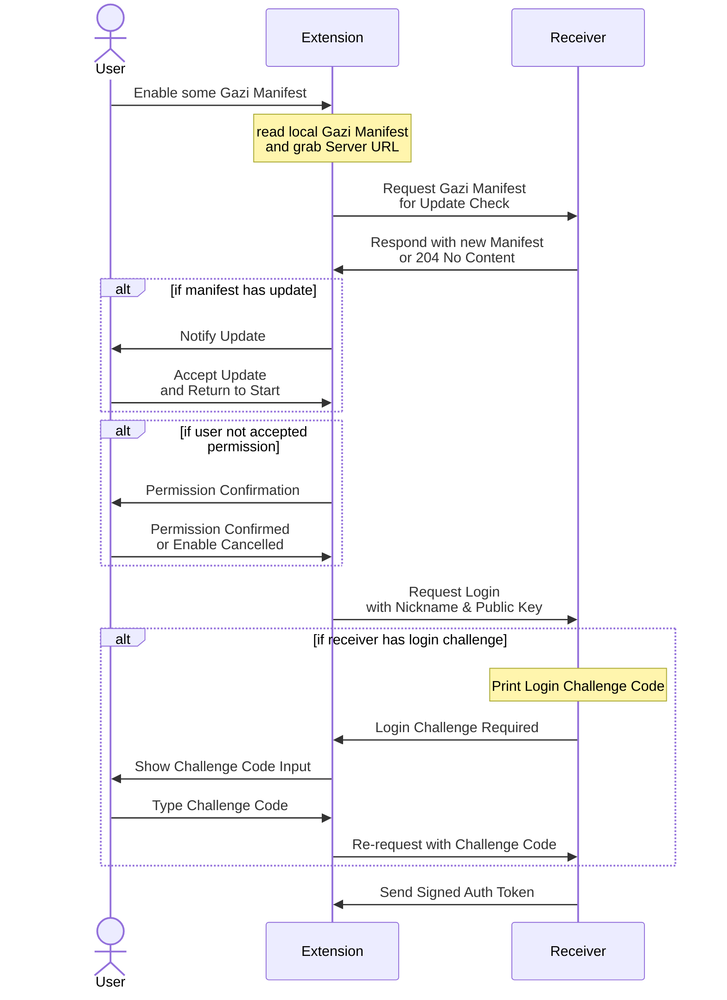

# :eggplant: gazi

Grab Another Zone's Information

**:eggplant: gazi** is an Web Extension grabbing site's information (HTML data, XHRs) into some daemon on the internet (and of coarse it could be your local daemon).

## Concepts

- **Gazi Receiver**: HTTP server waiting (1) identification request (2) data accumulation request.

### Full Connect Flow

## Gazi Manifest
